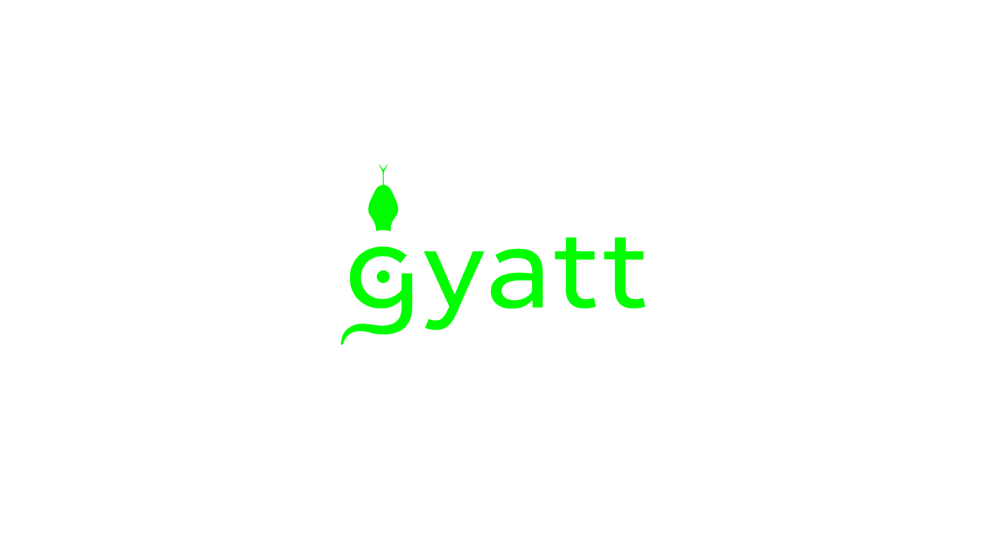

# Gyatt 3

Gyatt (Gee-yacht) is the Python-based programming language of the future.

## Erm, what the sigma 🤓?
Python, traditionally considered "easy" and "intuitive," uses too many archaic words like `print` and `math`. I wanted to fix this and keep Python in line with modern  English.

Gyatt is designed with a focus on readability, speed, and function.
The following is a tiny sample of Gyatt:
```js
aldi eightfreepizzas ashtonhall pi like pie rn
yap about pie rn

edgeuntil nocap aintbe cap tho
    yap about "lirili larila" rn
    stawp rn

johnpork (0/3 be 0) idk aint (1/4 be 0) btw (0/4 be 0) tho
    yap about "bombini gusini" rn

tralalerotralala tho
    yap about 1/0 rn
bombardilocrocodilo ZeroDivisionError tho
    yap about "trippi troppi troppa trippa" rn
tungtungtungtungsahur tho
    yap about 'brr brr patapim' rn
```

Although Gyatt code is easily readable by most people, a tiny minority may fail to understand it. The following is a translation guide for Gyatt:

```json 
{ 
  "None": "rizz",
  "False": "cap",
  "True": "nocap",
  "and": "btw",
  "as": "like",
  "assert": "areyousure",
  "break": "stawp",
  "continue": "period",
  "def": "gyatt",
  "elif": "timcheese",
  "else": "marvinbeak",
  "except": "bombardilocrocodilo",
  "finally": "tungtungtungtungsahur",
  "for": "iknewthatdoorhadalockonit",
  "from": "aldi",
  "if": "johnpork",
  "import": "ashtonhall",
  "==": "be",
  "lambda": "subaru",
  "nonlocal": "nogatekeep",
  "global": "nogatekeepfrfr",
  "not": "aint",
  "or": "idk",
  "pass": "idc",
  "raise": "lowtaperfade",
  "return": "yeet",
  "try": "tralalerotralala",
  "while": "edgeuntil",
  "yield": "chill",
  "math": "eightfreepizzas",
  "=": "finna",
  "range": "times",
  "+": "sigma",
  "!=": "aintbe"
}
  ```

## my cutie pattotie, how do I start 🫶?

The Gyatt Compiler(`gyatt.py`) is written in Python, and therefore, you will need [Python](https://www.python.org/) to run Gyatt. Next, clone this repository. Then, run `python3 setup.py.` Finnaly, write some Gyatt code or use the example `code.gyt` file provided and run `gyatt code.gyt`.


You can convert any python file to gyatt by running `gyattconvert [python file name]`

This is **signficantly** diffrent from Gyatt 2, as Gyatt 3 supports automatic aliasing to your bash, zsh, or fish profile

## uwu 😊

Q: Erm 🤓, wtf is going on with my strings?
<br>A: In Gyatt 2, a change was made to uwu-ify all strings by default. Ex (`how are you?` -> `h-how awe yoyu?`). Although highly recommended, this feature can be turned off with the `--nouwu` or `-n` command-line arguments.

## [angry comment] 😡
All comments in code are now banned (`# and '''`)

## yo tengo une erreur de compiler 😡🤬😠!!!

In Gyatt, you can specify a file to which python code will compile to by using a positional argument like `gyatt code.gyt argh` (compiled code will be saved in `argh.py`)

## top dos scariest hoompscahres 😱
The Gyatt Compiler requires you to end every line with either `tho` or `rn` for readability. However, be careful, as these are not interchangeable!! 
- `tho` is used as the colon(`:`) in Python (if, while, for, lambda, etc.)
- `rn` is used to signify the end of the line

## segfault 😭
gyatt3 has a russian roullete system where it has a 1/6 chance of segfaulting

## memory usage 😡 💢 💢 
gyatt3 initializes 16gb worth of data into memory for no reason 


## Compatability
### pookie bear 🥰, will my past Gyatt code work in Gyatt 3?
no

### is there documentation on what changed
no

## Future changes (not happening)

1. ~~Automatically add alias~~
2. ~~Add tokenization~~
3. ~~Custom Output~~
4. ~~UwUfication~~
5. ~~Python to Gyatt~~
6. Multi-Word Tokenization
7. Emojification
8. ~~completely ban comments (currently only heavily discouraged)~~
9. randomly swap all variables in memory (in testing)
10. ~~mappings in json format~~
11. vibe coding only (1b parameter model)
12. tokenization for py->gyt

# xoxo,
pokeshah ❤️
